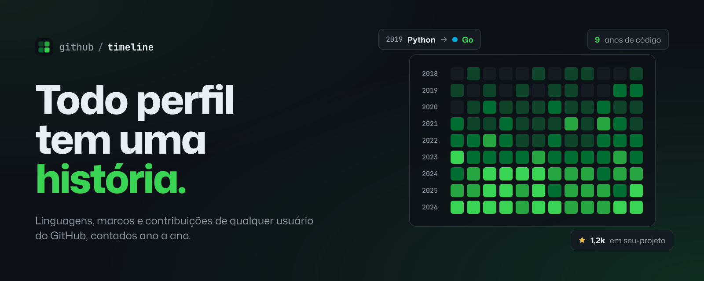

<p align="center">
  <a href="https://github-timeline.frangolab.com">
    
  </a>
</p>

<p align="center">
  <a href="https://github-timeline.frangolab.com"><b>github-timeline.frangolab.com</b></a>
  &nbsp;·&nbsp;
  <a href="#-comece-agora">Comece agora</a>
  &nbsp;·&nbsp;
  <a href="#-badge-para-o-readme">Badge</a>
  &nbsp;·&nbsp;
  <a href="#-hospede-o-seu">Hospede o seu</a>
</p>

<p align="center">
  
  
  
  
</p>

---

O gráfico de contribuições mostra **quanto** alguém programou. O **GitHub Timeline** conta **o quê**: digite um username e veja a trajetória ano a ano, com as linguagens que chegaram, os projetos que ganharam stars, as viradas de stack e os marcos que ficam escondidos numa lista de repositórios.

Nada é escrito à mão nem inventado. Cada frase sai dos dados públicos do GitHub.

## ✦ Comece agora

Não precisa instalar nada. Troque `<username>` pelo perfil que quiser:

| Quero…                       | Endereço                                                      |
| ---------------------------- | ------------------------------------------------------------- |
| ver a timeline de alguém     | `https://github-timeline.frangolab.com/u/<username>`          |
| comparar dois perfis         | `https://github-timeline.frangolab.com/u/<a>...<b>`           |
| uma imagem para compartilhar | `https://github-timeline.frangolab.com/u/<username>/card.png` |
| um badge para o README       | `https://github-timeline.frangolab.com/badge/<username>.svg`  |

A primeira visita a um perfil dispara a coleta, e a página mostra o progresso ao vivo. Daí em diante o snapshot fica salvo e abre na hora.

## ✦ O que aparece na timeline

- **Manchete**: o perfil resumido numa frase, como _"9 anos de código. De Python a Go."_ ou _"12k ★ em seu-projeto."_
- **Capítulos por ano**: o que estreou em cada ano (linguagens, topics) e os repositórios em destaque, ordenados por stars, forks, descrição e atividade.
- **Contribuições reais**: grade mensal com os dados do calendário de contribuições do GitHub, inclusive em organizações.
- **Conquistas**: primeiro repo, primeiro fork, 100 e 1.000 stars, poliglota, ano recorde, uma década de código e outras.
- **Organizações**: perfis de organização mostram os maiores contribuidores.
- **Dois temas**: claro e escuro, seguindo o sistema ou a sua escolha, em layout pensado também para celular.

## ✦ Compare dois perfis

Junte dois usernames com `...` e veja os dois lado a lado: números, linguagens em comum, quem estreou primeiro e um resumo do duelo.

```
https://github-timeline.frangolab.com/u/torvalds...gvanrossum
```

## ✦ Card para compartilhar

Toda timeline tem um PNG 1200×630, já usado nas meta tags Open Graph. Colou o link no LinkedIn, no X ou no Discord, a prévia aparece sozinha.

```
/u/<username>/card.png?tema=claro&variante=numero
```

| Parâmetro  | Valores                                                 | Padrão     |
| ---------- | ------------------------------------------------------- | ---------- |
| `tema`     | `escuro`, `claro`                                       | `escuro`   |
| `variante` | `headline` (manchete), `numero` (total de repositórios) | `headline` |

## ✦ Badge para o README

Um selo que se atualiza sozinho e leva quem clicar direto para a sua timeline:

```md
[](https://github-timeline.frangolab.com/u/seu-username)
```

O badge mostra o intervalo de anos e o total de repositórios, por exemplo `2019–2026 · 83 repos`.

## ✦ API

Os mesmos dados da página, em JSON:

| Rota                          | Retorna                                                     |
| ----------------------------- | ----------------------------------------------------------- |
| `GET /api/profile/<username>` | snapshot completo (manchete, anos, linguagens, conquistas…) |
| `GET /api/status/<username>`  | progresso da coleta via Server-Sent Events                  |
| `GET /healthz`                | estado do servidor e cota restante da API do GitHub         |

```sh
curl -s https://github-timeline.frangolab.com/api/profile/torvalds | jq .headline
```

## ✦ Hospede o seu

Você só precisa de um token do GitHub. Um token _classic_ **sem nenhum escopo** basta: ele só serve para subir o limite da API e liberar o calendário de contribuições.

### Com Docker

```sh
git clone https://github.com/Moscarde/github-timeline.git
cd github-timeline
cp .env.example .env        # preencha GITHUB_TOKEN
docker compose up -d --build
```

Pronto: `http://localhost:3000`. O banco SQLite fica no volume `timeline-data` e sobrevive a recriações do contêiner. A porta só escuta em `127.0.0.1`, pronta para ficar atrás de um proxy reverso (Nginx, Caddy, Traefik).

```sh
docker compose logs -f timeline   # acompanhar
docker compose down               # parar (com -v apaga o banco)
```

### Com Node

```sh
npm install
GITHUB_TOKEN=<token> npm run dev   # http://localhost:3000/u/<username>
```

Para produção: `npm run build && npm run start:prod`.

### Configuração

| Variável        | Para quê                                                                  | Padrão        |
| --------------- | ------------------------------------------------------------------------- | ------------- |
| `GITHUB_TOKEN`  | autenticar na API do GitHub (obrigatória)                                 | –             |
| `PORT`          | porta HTTP                                                                | `3000`        |
| `DATABASE_PATH` | arquivo SQLite dos snapshots e visitas                                    | `timeline.db` |
| `VISIT_SALT`    | sal do hash diário de IP; defina para manter as contagens entre reinícios | aleatório     |

Um passo a passo de deploy numa VPS com Nginx está em [`docs/deploy.md`](docs/deploy.md).

## ✦ Como funciona

```
username ─▶ coleta (REST + GraphQL) ─▶ snapshot no SQLite ─▶ páginas SSR, card PNG, badge SVG
```

1. **Coleta**: o servidor busca perfil, repositórios públicos, organizações e o calendário de contribuições com o próprio token.
2. **Derivação**: anos, linguagens, manchete e conquistas são calculados a partir dos metadados (datas de criação e push, linguagem, topics, stars, forks, homepage).
3. **Snapshot**: o resultado fica guardado por 12 h. Depois disso, a próxima visita coleta de novo.
4. **Render**: páginas renderizadas no servidor com Hono, card desenhado com Satori + resvg, badge em SVG puro.

### Limites e privacidade

- Só dados **públicos**: repositórios privados nunca aparecem.
- No máximo 3 coletas simultâneas e 10 timelines novas por IP a cada 10 minutos. Perfis já salvos não contam.
- Com menos de 10% da cota do GitHub, o servidor serve só snapshots salvos e avisa quando o dado está antigo.
- Visitas guardam apenas username, dia e um hash diário do IP, por 30 dias. Servem para a seção "Em alta".

## ✦ Stack

**TypeScript** · **Hono** (rotas e JSX no servidor) · **SQLite** via better-sqlite3 · **Satori + resvg** (card PNG) · **Vitest** · **Docker**. Fontes Mona Sans e JetBrains Mono hospedadas no próprio servidor, sem dependência de CDN.

```sh
npm test                           # testes
npm run typecheck && npm run lint  # tipos e lint
```

## ✦ Contribuições

Contribuições são muito bem-vindas! Encontrou um bug, pensou numa conquista nova ou numa forma melhor de contar a história de um perfil? Abra uma [issue](https://github.com/Moscarde/github-timeline/issues) ou mande um pull request.

<p align="center"><sub>Feito por <a href="https://github.com/Moscarde">@Moscarde</a> · se o projeto te ajudou, deixe uma ⭐</sub></p>
